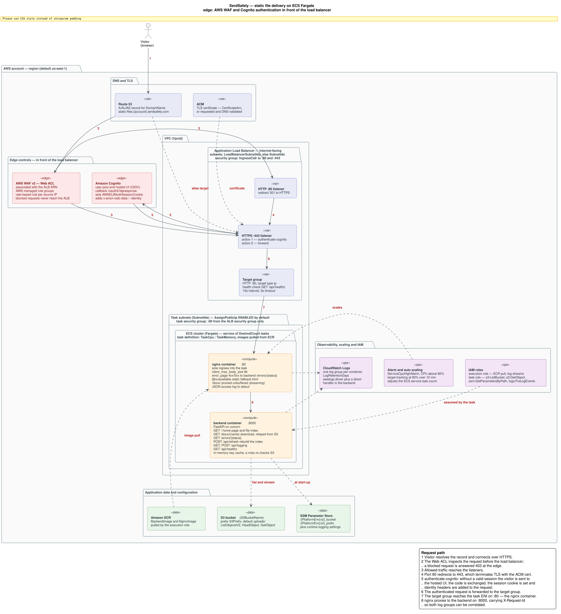

# SerdSafe Readme

This is not intended to be anything more than code for an interview.

Deliverables:

## Site URL: 
https://static-files.18634732.serdsafely.com/

## How the application works:

The application task runs two docker images stored in ECR:
* A customized nginx image that proxies for the backend service
* A backend service that runs and serves the webpages.

## The download mechanism

* The backend service pulls files from a defined S3 bucket defined in the SSM Parameter Store.  This could also be defined at task definition time if needed, but this allows for changing the bucket location without requiring a task definition change. 
* The bucket uploads are read and the names are cached as web routes in the server.  The routes allow for file downloads as a middle-man server.  For small files, it was determined that acting as a middle-man relay would work, however if there was a requirement on serving larger files, I would have implemented a presigned URL with S3 with a short lifespan, and served the file via a URL instead.  If the application _must_ handle the file, more design surrounding memory allocation would need to be done.
* As all files exist within S3 and are pulled from S3 at download time, a changed file should not require any cache updates.
* A cache miss will requery the S3 bucket for a new file before serving the file.
* A cache miss with no file existing will lead to a 404
* A non-existant endpoint will lead to a 404

## Container Logs and Runbook
All container logs are forwarded to their own cloudwatch log groups.  If there were an outage or a problem serving the application to a user, I would first check the nginx log group and search for any logs that aren't 200 errors.  I may live-tail the logs and search the logs for any 4XX or 5XX error codes, and trace down what the errors are, what endpoints they're trying to communicate with, and why it's failing.

### Site goes down at 3 AM - now what?
If I get paged at 3 AM, the first thing I'm doing is logging in and checking the cloudwatch alarms, and the metrics that triggered the alarms. Depending on a few common problems, we can check a few things:

1. Which alarm is triggered? If it's an average response latency issue, then we can look at resource utilization along each of the nodes.  If it's a 4XX/5XX response increase, we can tail the nginx logs, as mentioned above.

2. Screenshot all of the metrics, alerts, alarm states, and save them to the incident ticket.  This is all information we can look at in a retrospective.

3. Pull logs from any relevant services and put them all in the incident ticket.  More information is better here, so that we can track the logs and timestamps and match them to the screenshots.

4. Focus on bringing the service back online.  Priority is a mix of data gathering as well as getting services healthy.  Making decisions in an emergency may be necessary, such as increasing resources to a service, or restarting a hung service that didn't have a restart policy enabled for unhealthy tasks.

5. Document what worked and what didn't work.  Undo any changes that weren't relevant to the fix, unless it's determined that it's better for the stack in the long run, then include the changes that were made in an emergency change request ticket so that all changes are properly tracked.

6. Determine if the outage needs a retrospective, along with notifying all stakeholders.  Was it an application defect? Was it an infrastructure issue? Is there a pattern with this incident that matches past incidents?  These questions should be part of the retrospective as we fill out and finish up the incident ticket.

7. Determine the root cause of the issue and document this in the incident ticket.  This will be used for the next step:

8. Develop long-term fixes (action plans) based around the incident.  Not all incidents require action plans, but generally site reliability is built around the idea of actioning against any outages to ensure the outage doesn't happen again.  

## Cloudformation

Located at /deploy/cloud-formation.yaml

The CF template should work from scratch.  All it needs is access to a private repo held in the existing AWS account, which can be completed on my end once I'm sent the information on which AWS account will need access to the repo.  This will be achieved by a policy on the ECR repositories.

The cloudformation will create the following:

* Route53 DNS record (if one doesn't exist)
* Certificate for the load balancer (if an ARN isn't supplied)
* Application Load Balancer (No integration with WAF or Cognito, focus is just to get a baseline running)
* Target Groups for the ALB's HTTPS listener
* A redirect rule for port 80 to forward to port 443
* A basic alarm for CPU Utilization over 80%
* A target tracking alarm for CPU Utilization over 80% over 10 minutes to scale out new Fargate instances
* An ECS cluster using Fargate
* An ECS task definition for the application to deploy
* An ECS service based on the task definition
* A security group for the load balancer
* Log groups for all of the containers
* IAM Roles for the task as well as the execution task
* SSM Parameters for the application to use > s3_bucket and s3_prefix

The following parameters are implemented in the cloudformation template:

* _ClusterName_: ECS Cluster name to deploy.
* _CreateEcsCluster_: True/False.  If true, create the cluster.  False deploys into an existing cluster.
* _ServiceName_: Name of the ECS service.
* _TaskFamily_: Task definition family 
* _VpcId_: Dropdown list of the VPCs in the account
* _SubnetIds_: Dropdown list of the subnets in the account.  Pick the subnets that the tasks will be deployed to.
* _LoadBalancerSubnetIds_: Optional, used for when the application is deployed into private subnets.  This is for selecting the subnets that the load balancers will be deployed to.  If blank, will use SubnetIds.
* _AssignPublicIp_: ENABLES/DISABLED.  Enabled by default, but can be disabled for tasks deployed to private subnets.  Tasks will need to reach out to AWS resources via the public internet, so deployment will fail if disabled while deployed to a public subnet.
* _CertificateArn_: Optional.  Certificate ARN used for a pre-existing Certificate.  If no certificate exists, it will request one based on the DomainName.
* _DomainName_: Optional.  URL that will be used for the deployment.  If supplied, while no CertificateArn is supplied, an ACM request for a certificate will be created.  Can be paired with HostedZoneId to validate the certificate request.
* _HostedZoneId_: Optional.  Used to implement the DomainName record, and request the Certificate.
* _IngressCidr_: Load balancer-based ingress security group CIDR.  Defaults to 0.0.0.0/0 for all access from the internet.
* _EnableDeletionProtection_: Deletion protection.  Defaults to "false".
* _BackendImage_: Can be customized for images other than the default image. Repo access for the default image must be granted manually in the original account.
* _NginxImage_: Can be customized for images other than the default image.  Repo access for the default image must be granted manually in the original account.
* _PlatformEnv_: Used to select the parameter store's namespace.  /<PlatformEnv>/* will be the namespace used here.
* _S3BucketName_: Bucket used by the application to serve the documents.
* _S3Prefix_: Prefix aligned to all file names in the S3 bucket that will need to be served by the application.  Defaults to "uploads/"
* _TaskCpu_: CPU allocation to backend and nginx containers.
* _TaskMemory_: Memory allocation to backend and nginx containers.
* _DesiredCount_: Amount of tasks to run from the service.
* _LogRetentionDays_: Retention on both container log groups.

## Shipping a change of image

A new image would be deployed.  Depending on the size of the deployment, we may either opt to use a rolling update, or a canary update (the larger the number of tasks, the more we lean to a canary update) where a small percentage of the active tasks use the new image, and we determine the success rate of the new image compared to the old image.  Either task update allows us to roll back to a previous version of the task definition if necessary, in the event of a failed update.

The new version of the image would be validated by more than one engineer and/or manager prior to deployment, as to ensure that no one engineer is making critical production changes without approval.  The exception would be under emergent circumstances where an outage is already taking place, in which case we'd go through the normal outage steps discussed above.

## Gaps

* The cloudformation doesn't include anything outside of building the application.  This means that we aren't building in any cognito or WAF integration.
* The monitors on the system are not all-inclusive, and are somewhat lacking.  More time to identify Service Level Indicators would need to take place over time to find real points of failure.  To start with, looking at resource utilization, as well as the p90 of latency is a good place to start.  This allows us to avoid the outliers of the long wait times, while still viewing the 90th percentile of response times.
* The application isn't built for production - I'm not a web developer, more of an infrastructure engineer that focuses on site reliability.  99% of the web application was written by claude, so I can explain how it works (mostly), just not build it from scratch.
* A dashboard was skipped.  I ran out of time building this, but I would have put all the alarm-based metrics into the dashboard, as well as look for any other metrics that would have been interesting.  How many services are running, what's the scaling looking like lately, etc.

## AI Logs
Here are the logs from the AI usage.  I used Claude Code only.

Website via Nginx: https://claude.ai/code/session_01KLA8foWFARPf9iQUGxrssc
Part 2 (Somehow the sessions got separated when I cancelled a request): https://claude.ai/code/session_018B5yVYUTG5iYzPGYvuTdiu
Cloud formation development: https://claude.ai/code/session_019Af8a9zAfuV8hnqEDct9mk

### Manual Changes from Claude Code

There were a few instances where some testing was completed with localstack on my machine to emulate an AWS environment.  For those tests, there were some edits to the environment variables to use those systems.  Along with this, local docker doesn't use the same backend as awsvpc does, so manual interventions to test had to be made to use backend service names and not 127.0.0.1.

Alarm cloudformation code required tweeking as the code insisted on using 60% as the alarm threshold instead of the 80% requested in the task.

Some manual edits were attempted in the python code, which ended up breaking things and Claude (thankfully) fixed afterwards.  Learning new packages are part of this task involved some trial and error... mostly error.

Changes to the cloudformation took place in the Infrastructure Composer.  That tool is incredible at developing the templates.

